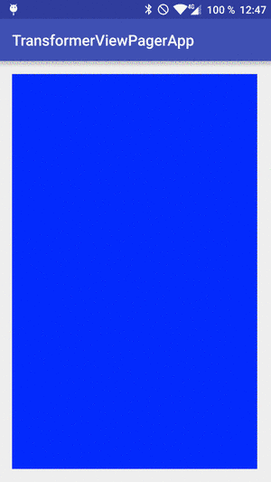

# android-transformer-viewpager
Example app on using the ViewPager.PageTransformer.

This example app has few tricks:

- It recreates an infinite ViewPager, but the truth is that the ViewPager Adapter has only three pages: The central one, left and right.
- Each page shows a different color, generated randomly.
- When the user switches to a new page, the other two page colors are generated.
- Also, once the page switch animation is done, the ViewPager switches to the central page without the user noticing, creating the illusion of having an infinite ViewPager.
